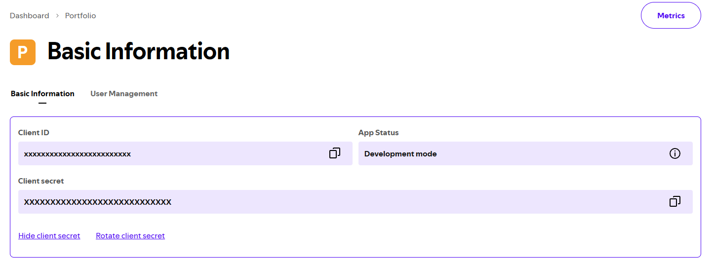
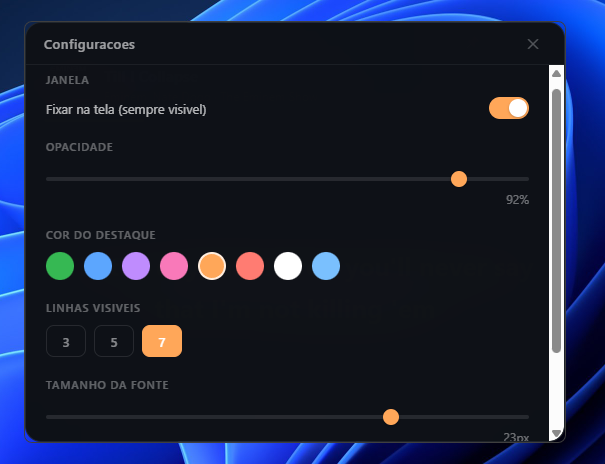

# Spotify Lyrics

A lightweight, always-on-top desktop overlay that displays synced lyrics for your currently playing Spotify track.

Built with [Tauri](https://tauri.app/) (Rust) + vanilla HTML/JS.


## Features

- Real-time synced lyrics from [LRCLIB](https://lrclib.net/)
- Transparent, always-on-top overlay window
- Customizable opacity, accent color, font size, and visible lines
- Smart lyric matching (handles remasters, features, remixes)
- Spotify OAuth authentication

## Prerequisites

- [Rust](https://rustup.rs/)
- [Node.js](https://nodejs.org/) (for Tauri CLI)

## Getting Started

### 1. Clone and install

```bash
git clone https://github.com/eduardomrigo/Spotify-Lyrics.git
cd Spotify-Lyrics
npm install
```

### 2. Create a Spotify App

Go to the [Spotify Developer Dashboard](https://developer.spotify.com/dashboard) and create a new application. Add the following Redirect URI in the app settings:

```
http://127.0.0.1:8888/callback
```



### 3. Run

```bash
npm run tauri dev
```

### 4. Connect

Paste your **Client ID** and **Client Secret** in the app setup screen and click **Conectar**. Play a song on Spotify and the lyrics will appear automatically.



## Build

```bash
npm run tauri build
```

The installer will be generated in `src-tauri/target/release/bundle/`.

## License

[MIT](LICENSE)
